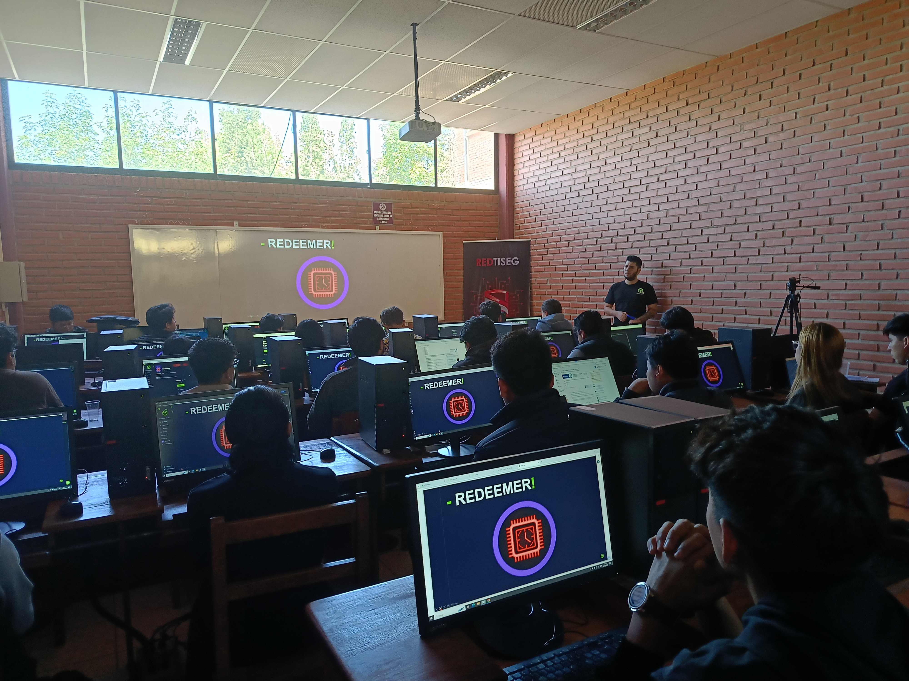

<h1 align="center">👋 Bienvenido a la Comunidad HackTheBox Cochabamba 👨‍💻</h1>

  

---

## Sobre Nosotros

En la **Comunidad HackTheBox Cochabamba**, nos dedicamos a aprender, compartir y explorar el mundo de la ciberseguridad. Con el apoyo de HackTheBox y otros entusiastas de la tecnología, nos reunimos para resolver retos, compartir conocimientos y potenciar nuestras habilidades. Nuestra misión es fomentar un ambiente de colaboración, aprendizaje y superación constante.

  

---

## Beneficios de unirte a la comunidad

Al unirte a nuestra comunidad, podrás disfrutar de una serie de beneficios diseñados para potenciar tu aprendizaje y crecimiento en el campo de la ciberseguridad:

- 🧠 **Aprendizaje colaborativo**: Mejora tus habilidades técnicas con ayuda de otros miembros.
- 🎯 **Retos y CTFs**: Participa en competencias para poner a prueba tus conocimientos.
- 📚 **Recursos educativos**: Accede a materiales seleccionados por y para la comunidad.
- 🧑‍💻 **Networking**: Conecta con personas apasionadas por la ciberseguridad.
- 💬 **Espacio de discusión**: Comparte ideas, noticias y dudas técnicas.

---

## 🌐 Nuestras Redes Sociales

  
  
  
  

---
